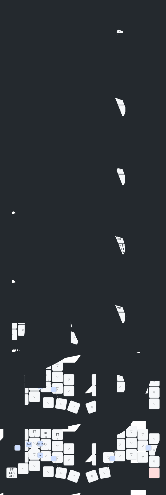

# zmk-config-roBa

## レイヤー構成

| レイヤー | 名前 | 呼び出し方 | 役割 |
|---|---|---|---|
| 0 | Default | 常時 | 通常のキー配列。英字・記号・修飾キー |
| 1 | Function | ENTERを長押し | F1〜F13 ファンクションキー |
| 2 | Num | SPACEを長押し | 数字・計算記号・括弧などの記号 |
| 3 | Arrow | 無変換を長押し | 矢印・Home/End・ウィンドウ操作 |
| 4 | Mouse | トラックボール操作で自動 | マウスクリック（左・中・右） |
| 5 | Scroll | Iを長押し | トラックボールでスクロール |
| 6 | BT/Boot | 変換を長押し | Bluetooth接続切り替え・ブートローダー |

## コンボ

| キー | 動作 |
|---|---|
| S + D | Tab |
| D + F | Shift + Tab |
| A + S | 無変換 |
| C + V | = |
| L + ' | " |
| F + Space | 英語切り替え |
| J + Enter | 日本語切り替え |